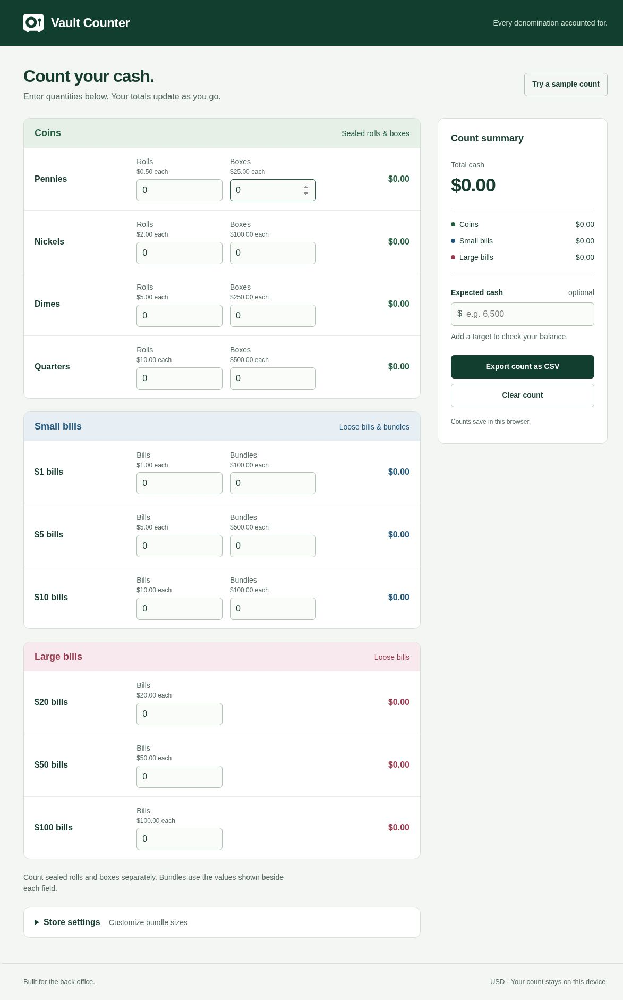

# Vault Counter

**Count the packages and bills. Keep the denomination breakdown and total together.**

Vault Counter began as a practical tool for coworkers counting a store’s back-office cash and transferring the breakdown into a company spreadsheet. The current app keeps that direct workflow: enter quantities, check totals, compare an expected amount, and export the record.

[Open Vault Counter](https://counter.graydonwasil.com/) · [Counting workflow](#count-a-vault) · [Bundle settings](#match-your-stores-bundles) · [Run locally](#run-locally)



*Actual public desktop capture with an empty count.*

## Count a vault

1. Enter quantities of **sealed coin rolls and boxes**, **loose bills**, and **bill bundles**. Empty fields count as zero.
2. Read the per-denomination totals, category subtotals, and grand total as you work.
3. Optionally enter expected cash to see whether the count balances, is short, or is over.
4. Export a CSV when you need a portable denomination-level record.

| Group | What you enter |
| --- | --- |
| Green coin section | Roll and box counts for pennies, nickels, dimes, and quarters |
| Blue small-bill section | Loose bills and bundles for $1, $5, and $10 |
| Red large-bill section | Loose $20, $50, and $100 bills |

The model covers **10 USD denominations through 17 quantity fields**. Enter the number of packages or bills, not the dollar value you want them to represent.

| Action | Behavior |
| --- | --- |
| **Store settings** | Configure how many bills are in each supported bundle |
| **Apply bundle sizes** | Apply those settings and recalculate the current count |
| Expected cash | Add an optional target for the difference calculation |
| CSV export | Export quantities, package values, subtotals, grand total, and optional target comparison |
| **Clear count** | Reset quantities and target while keeping store settings |
| **Undo clear** | Restore the previous count until another edit |
| **Try a sample count** | Load labeled demonstration quantities into an empty count using the current bundle settings |

## Match your store’s bundles

The original defaults are **100 bills per $1 bundle**, **100 per $5 bundle**, and **10 per $10 bundle**. These are workplace conventions, not universal banking rules. Expand Store settings, change the bill counts, and apply them before interpreting the totals.

For example, a $5 bundle containing 100 bills contributes $500; the same denomination configured as 50 bills contributes $250 per bundle. The application uses the applied setting consistently in calculation and export.

Coin packaging has fixed values in the current model:

| Coin | Roll value | Box value |
| --- | ---: | ---: |
| Pennies | $0.50 | $25.00 |
| Nickels | $2.00 | $100.00 |
| Dimes | $5.00 | $250.00 |
| Quarters | $10.00 | $500.00 |

## Validation and saved state

Quantity inputs accept whole numbers from **0 to 1,000,000**. Bundle sizes accept whole numbers from **1 to 1,000,000**. Invalid quantities show inline errors and block export rather than silently producing an incomplete record.

Calculations use integer cents. A shared denomination model supplies the input definitions, package values, totals, settings, and CSV output, reducing the chance of those views drifting apart.

Valid counts, target, applied bundle settings, and the sample marker save automatically in localStorage under `vault-counter.v2`. There is no account, shared database, synchronization, authenticated administrator role, or audit-history system. **Store settings is local configuration.**

The inspected application has no count-transmission path. Browser storage belongs to the current browser and origin; clearing site data removes saved state. Export a CSV when you need a portable record. Calculation and export continue if local storage is unavailable.

## Interface

The page retains distinct coin, small-bill, and large-bill groups, labeled inputs, keyboard focus indicators, and live total announcements. A mobile total bar keeps the running total visible while counting through the form.

The captured view above was inspected on desktop. The settings disclosure and mobile layout were checked in source rather than fully exercised in this documentation review.

## Stack and implementation

| Component | Technology or file | Responsibility |
| --- | --- | --- |
| Interface | Semantic HTML and responsive CSS | Counting form, category layout, settings, and totals |
| Denomination model | `blocks/money.js` | Pure integer-cent calculations, package rules, validation, and export data |
| Application controller | `blocks/app.js` | Input events, rendering, persistence, and user actions |
| Local server | `scripts/serve.js` | Dependency-free HTTP serving with hidden-file and path-traversal checks |
| Tests | Node’s built-in test runner | Packaging values, mixed totals, invalid input, target precision, and custom bundles |
| Configured hosting | Cloudflare Workers Static Assets | Serve the static `dist/` output |

The current counter uses plain HTML, CSS, and JavaScript modules, with no runtime dependencies. Older React/Firebase/API versions are separate repositories and are not required by this static app.

## Run locally

Use **Node.js 22 or newer**. Basic local counting needs no dependency installation:

```sh
git clone https://github.com/Arrangedgodly/vault-counter-v2.git
cd vault-counter-v2
npm start
```

Open `http://localhost:5187`. You can select another port with `PORT=5190 npm start` in a compatible shell. The development server binds to all interfaces so another paired device can preview it; run it on a trusted network.

Alternatively, use a static HTTP server. JavaScript modules require HTTP rather than opening `index.html` directly.

```sh
npm test
```

The repository supplies six calculation/validation tests. They were inspected, not freshly executed in this documentation pass.

## Build and deploy

Install development dependencies when using the deployment tooling:

```sh
npm ci
npm test
npm run build
```

The build copies only `index.html`, `pages/`, `blocks/`, and `images/` into `dist/`. Asset paths are relative, including for project-subdirectory hosting. The historical root `CNAME` is not part of that build output.

For the configured Cloudflare Workers Static Assets workflow:

| Setting | Value |
| --- | --- |
| Install command | `npm ci` |
| Build command | `npm run build` |
| Deploy command | `npx wrangler deploy` |
| Worker name | `vault-counter-v2` |
| Asset directory | `dist` |

The deployment environment must supply its own Cloudflare credentials. None are stored in the repository. Wrangler also runs the configured build for direct CLI deployment; after installing dependencies, `npm run deploy` provides the equivalent command.

To validate the deployment package without publishing:

```sh
npx wrangler deploy --dry-run
```

The generated `dist/` can also be served by another static host. The verified public demo is [counter.graydonwasil.com](https://counter.graydonwasil.com/). The repository’s older `CNAME` names `vault.graydonwasil.com`; review domain ownership and hosting configuration before reusing it. The exact deployed commit/provider was not independently established from deployment logs.

## Project context

The project grew from a real counting workflow and provides a concrete example of shared domain modeling, input validation, accessible form design, browser-local state, and automated calculation tests. Historical workplace impact belongs to the project’s backstory; the app does not measure operational error reductions or collect analytics to substantiate them.

No project license file is included in the inspected repository.
